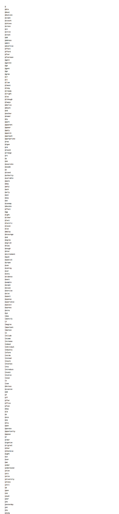
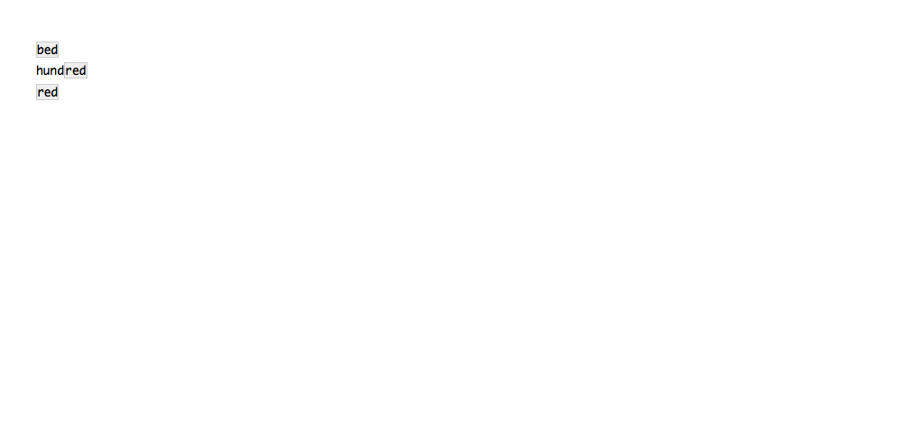
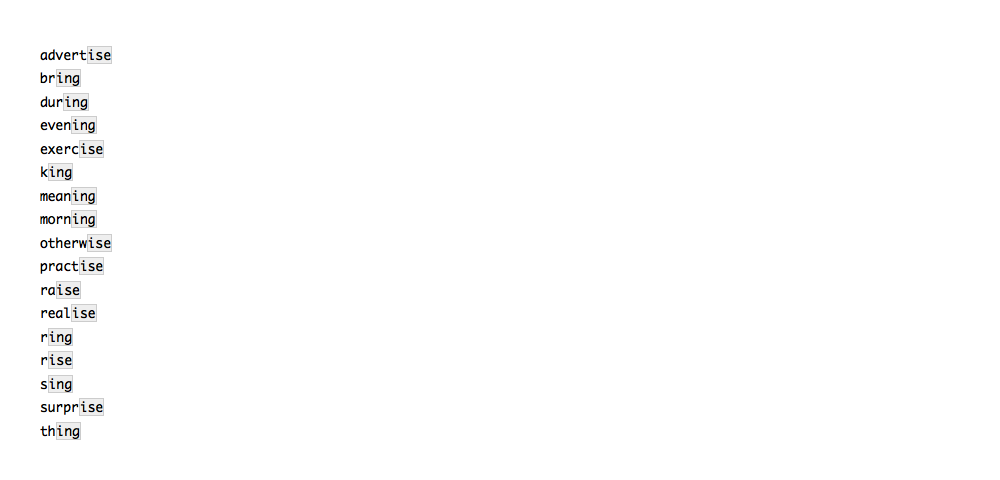
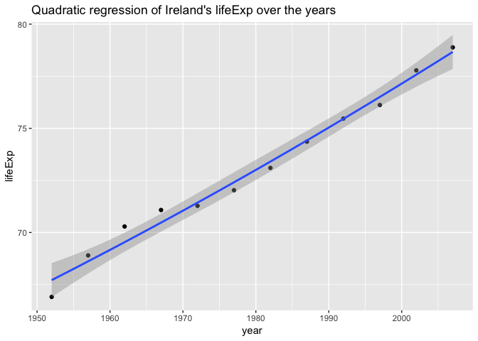
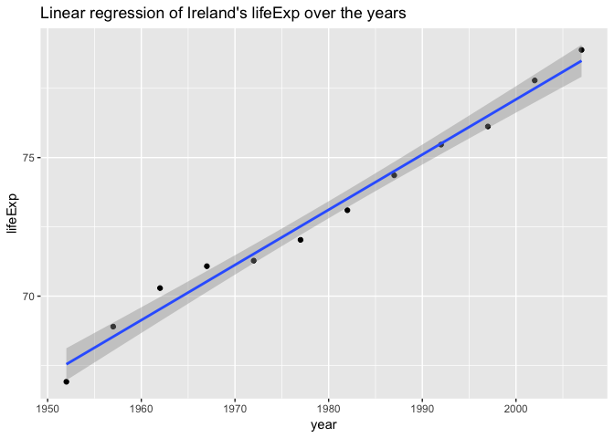
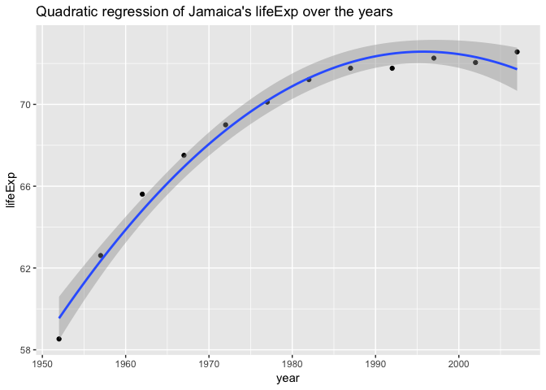

HW06-data-wrangling-wrap-up
================
Rachel Lobay
2018-11-04

Table of contents
=================

-   [Part 1: Character Data Overview](#part-1-character-data-overview)
    -   [Exercise 1: Difference between paste() and paste0()](#exercise-1-difference-between-paste-and-paste0)
    -   [Exercise 2: Difference between sep and collapse arguments to str\_c()](#exercise-2-difference-between-sep-and-collapse-arguments-to-str_c)
    -   [Exercise 3: Write a function that turns a vector into a string](#exercise-3-write-a-function-that-turns-a-vector-into-a-string)
    -   [Exercise 4: Create regular expressions to find all words](#exercise-4-create-regular-expressions-to-find-all-words)
-   [Part 2: Writing Functions](#part-2-writing-functions)
    -   [Focus on one country for a quadratic regression example](#focus-on-one-country-for-a-quadratic-regression-example)
    -   [Code that works using I()](#code-that-works-using-i)
    -   [Create a function to obtain the offset quadratic regression coefficients](#create-a-function-to-obtain-the-offset-quadratic-regression-coefficients)
    -   [Test on other gapminder countries](#test-on-other-gapminder-countries)

Part 1: Character Data Overview
===============================

I will read and work on the exercises from the [Strings chapter of R for Data Science](https://r4ds.had.co.nz/strings.html).

First, I will load the necessary packages for this part of the assignment.

``` r
library(tidyverse)
library(stringr)
```

Exercise 1: Difference between paste() and paste0()
---------------------------------------------------

Question from Section 14.2.5:

In code that doesn’t use stringr, you’ll often see paste() and paste0(). What’s the difference between the two functions? What stringr function are they equivalent to? How do the functions differ in their handling of NA?

Answer:

Since there are multiple questions in this exercise, we will go through each question one-by-one.

First, we will see what the difference is between paste() and paste0().

A good approach to discern the difference between paste() and paste0() is to first test them on a simple case. Hence, I will look at two strings that say "Hi" and "mom".

We will see what the output is for paste.

``` r
paste("hi","mom")
```

    ## [1] "hi mom"

Next, we will inspect paste0.

``` r
paste0("hi","mom")
```

    ## [1] "himom"

Clearly, we can see that when we use the paste function on the two strings, we get a space between the strings by default. However, when we use the paste0 function, we do not get a space between the string. Hence the paste and paste0 functions serve slightly difference purposes.

Now, we will move on to see what stringr function paste() and paste0() are equivalent to.

Out of the possible stringr functions, I think that str\_c() is the closest function because, as we discussed in class cm102, str\_c() is used to concatenate strings. Now, out of paste() and paste0(), which is str\_c() closest in function to? Let's try it out below and see!

``` r
str_c("hi", "mom")
```

    ## [1] "himom"

So, we get "himom" as our output without any space between the strings. Hence, str\_c() is more similar to paste0() than paste().

The final question to answer is how do the functions differ in their handling of NA?

Again, our approach to this problem will lead with an example. We shall see what happens when we use NA as an argument in each of paste(), paste0(), and str\_c().

First, we will look at the paste function with an NA as the third argument.

``` r
paste("hi","mom", NA)
```

    ## [1] "hi mom NA"

It looks like with the paste function, NA is made into a string and treated as such. So, we see that, like with the strings "hi" and "mom", there is a space between the 'strings' "mom" and "NA".

Now, we will look at the paste0 function with an NA as the third argument.

``` r
paste0("hi","mom", NA)
```

    ## [1] "himomNA"

Similar to the paste function, we see that the paste0 function appears to make NA into a string and treat it as such. So, there is no space between the mom and NA 'strings'.

Finally, we will look at the str\_c function with an NA as the third argument.

``` r
str_c("hi","mom", NA)
```

    ## [1] NA

When we have a NA as the third argument of str\_c, we only get NA returned. So, what is happening? Based on our example, it looks like str\_c puts importance on the NA. If we try to have the NA between the "hi" and "mom" strings, does the same thing happen?

``` r
str_c("hi", NA, "mom")
```

    ## [1] NA

Yes. There is just a NA returned.

Finally, what if NA comes before our "hi" "mom" strings.

``` r
str_c(NA, "hi", "mom")
```

    ## [1] NA

Again, there is just a NA returned.

Based on our examples, we can conclude that the str\_c() function will return a NA if any argument is NA.

Exercise 2: Difference between sep and collapse arguments to str\_c()
---------------------------------------------------------------------

Question from Section 14.2.5:

In your own words, describe the difference between the sep and collapse arguments to str\_c().

Answer:

I suppose the easy (and cheap) solution would be to look up the str\_c() function and reiterate what it says the arguments are in my own words... But, I will use my example then interpret appraoch to try to see the differences between the two arguments.

We shall look at the two arguments in str\_c() using an example where we will concatenate strings that pertain to a few of Van Gogh's famous paintings.

If we just use the sep argument, let's see what we find.

``` r
str_c(c("The Starry Night", "Sunflowers", "The Potato Eaters"), "Van Gogh", sep = " ")
```

    ## [1] "The Starry Night Van Gogh"  "Sunflowers Van Gogh"       
    ## [3] "The Potato Eaters Van Gogh"

So we see that we get three strings "The Starry Night Van Gogh", "Sunflowers Van Gogh", and "The Potato Eaters Van Gogh". However, let's say we want to use `sep = " by "` so that we get, for example, "The Starry Night by Van Gogh" as one of our outputs. Does that work?

``` r
str_c(c("The Starry Night", "Sunflowers", "The Potato Eaters"), "Van Gogh", sep = " by ")
```

    ## [1] "The Starry Night by Van Gogh"  "Sunflowers by Van Gogh"       
    ## [3] "The Potato Eaters by Van Gogh"

Yes. It does. What we can say from this is that the sep argument puts a string of the sep argument in between the string arguments.

Now, let's look at the collapse argument. We shall start by looking at its default.

``` r
str_c(c("The Starry Night", "Sunflowers", "The Potato Eaters"), " Van Gogh", collapse="")
```

    ## [1] "The Starry Night Van GoghSunflowers Van GoghThe Potato Eaters Van Gogh"

By default we get no space between the strings. Furthermore, the output is a vector of length one with all the individual strings pasted together (as was discussed in class).

We shall try to have a comma in between each of the strings when we use the collapse argument to collapse those strings down into a vector of length one.

``` r
str_c(c("The Starry Night", "Sunflowers", "The Potato Eaters"), " Van Gogh", collapse=", ")
```

    ## [1] "The Starry Night Van Gogh, Sunflowers Van Gogh, The Potato Eaters Van Gogh"

We got what we wanted. So, it did work to use a comma as the argument of collapse.

Now, what if we try to put a string "or" as the argument of collapse?

``` r
str_c(c("The Starry Night", "Sunflowers", "The Potato Eaters"), " Van Gogh", collapse="or")
```

    ## [1] "The Starry Night Van GoghorSunflowers Van GoghorThe Potato Eaters Van Gogh"

No dice. the result doesn't produce or between each of the string arguments. Rather, we get the default collapse argument, which was just all the strings pasted together in one vector of length one with no space between the strings.

What if we now used the sep and collapse arguments together.

``` r
str_c(c("The Starry Night", "Sunflowers", "The Potato Eaters"), " Van Gogh", sep = " by", collapse=", ")
```

    ## [1] "The Starry Night by Van Gogh, Sunflowers by Van Gogh, The Potato Eaters by Van Gogh"

The output is one vector of length one with a comma between each of the original string arguments and a string of the sep argument " by" in between each of the original string arguments.

Let's look at the big picture. What is the difference between the sep and collapse arguments of str\_c())? Simply put, the sep argument puts a string of the sep argument in between the string arguments, while the collapse argument separates the elements of the vector of length one.

Exercise 3: Write a function that turns a vector into a string
--------------------------------------------------------------

Question from Section 14.2.5:

Write a function that turns (e.g.) a vector c("a", "b", "c") into the string a, b, and c. Think carefully about what it should do if given a vector of length 0, 1, or 2.

Answer:

We shall create a function and test it using the vector c("U", "B", "C").

The prompt wants us to handle vectors of length 0, 1, or 2. Therefore, when we design our function, we want to keep the deal with the cases of different vector lengths.

For example: - A vector of length 0 would be the empty string "". - A vector of length 1 would be something like "U". - A vector of length 2 would be "U and B" (ie. we want to return a string of the two vector elements separated by and). - Finally, for a vector of length 3, we would have a string "U, B, and C" returned.

An easy solution would be to use, cumbersome but effective, if-else statements to handle the case where the vector is less than length 2, exactly equal to length 2, and the case where the vector is greater than length 2.

<!-- The last part under the else statement is a bit tricky to understand, so I will explain the steps. To minimize the code, I only used two lines. In the first line, I created a vector of length one of all the elements but the last element of the original vector, where each element is separated by a comma. The second line is where I simply add ", and " between the vector of length one and last element.-->
``` r
vector_to_string_fun <- function(x){
  # handles the cases where the vector is less than length 2
  if(length(x) < 2){
    x
  }
  # handles the cases where the vector is exactly length 2
  else if(length(x) == 2){
    x %>% 
    str_c(x[1], " and ", x[2]) # separates the two elements of the vector by " and "
  }
  else {
     # handles the cases where the vector is > than length 2
    # create a vector of length one of all the elements but the last element of the vector, where each element is separated by a comma
    str_before_last <- str_c(x[seq_len(length(x)-1)], collapse = ", ")
    # add ", and " between str_before_last and last element
    str_c(str_before_last, ", and ", x[length(x)])
  }
}
```

Now we shall test it using our ubc example.

``` r
# Define ubc vector
ubc <- c("U", "B", "C")

vector_to_string_fun(ubc)
```

    ## [1] "U, B, and C"

We got what we wanted - a vector of length 1 that is a string "U, B, and C".

Exercise 4: Create regular expressions to find all words
--------------------------------------------------------

Question from Section 14.3.3:

Create regular expressions to find all words that:

1.  Start with a vowel.
2.  That only contain consonants. (Hint: thinking about matching “not”-vowels.)
3.  End with `ed`, but not with `eed`.
4.  End with `ing` or `ise`.

For some background, this exerise pertains to the part of the chapter on viewing HTML rendering of expression matches for which we will use a variant of the the str\_view() function.

Answer: Before we get to creating the expressions, we should go over the five useful tools from the [notes](https://r4ds.had.co.nz/strings.html) corresponding to this exercise that are special patterns that match more than one character:

-   `.`: matches any character apart from a newline.
-   `\d`: matches any digit.
-   `\s`: matches any whitespace (e.g. space, tab, newline).
-   `[abc]`: matches a, b, or c.
-   `[^abc]`: matches anything except a, b, or c.

Don't forget position indicators from cm102!

-   `^` corresponds to the **beginning** of the line.
-   `$` corresponds to the **end** of the line.

And don't forget about quantifiers/repetition from cm102!

-   `*` for 0 or more
-   `+` for 1 or more
-   `?` for 0 or 1

Also, from the [notes](https://r4ds.had.co.nz/strings.html), "You can use alternation to pick between one or more alternative patterns. For example, abc|xyz will match either "abc", or "xyz"." We can see this will come in handy for solving 4. where we want to find all words ending with `ing` or `ise`. Furthermore, "if precedence ever gets confusing, use parentheses to make it clear what you want". Meaning, like we discussed in cm102, use parentheses to indicate precedence.

Next, what function do we use str\_view() or str\_view\_all()?

Note that str\_view() shows the first match of a pattern. Therefore, we will use the str\_view\_all() function to show all the matches for a particular pattern. Note that I will set `match = TRUE` because then we control what is shown to see only the strings that have the pattern.

Now, we shall start to tackle 1.

1.  Find all words that start with a vowel.

Note that I set `match = TRUE` because then we see only strings that have the pattern and not all of them. From our above tool set, we can see that we want to match the vowels (including y). So we use, \[aeiouy\]. Additionall, since we want the words that START with a vowel, we use the position indicator ^. Hence, the solution is:

``` r
words %>% 
  str_view_all("^[aeouiy]", match = TRUE)
```



We can see this appears to produce the correct output for words that start with a vowel (although there are a lot of matches to go through).

1.  Find all words only contain consonants. (Hint: thinking about matching “not”-vowels.)

The hint basically gives us the key to the solution. From our tool kit above, we see `[^abc]`: matches anything except a, b, or c. Hence, we will use \[^aeouiy\]. Next, we want to consider the words begin with a vowel, continue without a vowel, and end without a vowel. So, we use the beginning indicator ^, \* that indicates 0 or more, and finish off with the ending position indicator $.

``` r
words %>% 
str_view_all("^[^aeouiy]*$", match = TRUE)
```


We can see this appears to produce the correct output for words that only contain consonants.

1.  Find all words that end with `ed`, but not with `eed`.

So, we want all words that end with `ed`. We can use the ending position indicator `$` to achieve that. So we have `ed`. Next, we don't want the words that end with `eed`. To do that, we can refer to the pattern `[^abc]`: matches anything except a, b, or c. So, all together, the pattern is `[^e]ed$`. Let's see if that works...

``` r
words %>% 
str_view_all("[^e]ed$", match = TRUE)
```



Looks like this appears to produce the correct output for words that end with `ed`, but not with `eed`.

1.  Find all words that end with `ing` or `ise`.

This was the problem that clearly used the alternation symbol | (which is basically "or"). Now, since ing and ise overlap with the i character, we will use parentheses like did with the beer or bear example in cm102, which I will post below:

``` r
# first define function str_view_all_match
str_view_all_match <- function(countries, pattern) {
    str_view_all(countries, pattern, match=TRUE)
}
```

Beer or bear?

``` r
c("bear", "beer", "bar") %>% 
    str_view_all_match(pattern = "be(e|a)r")
```


In that example, we used be(e|a)r to say that the letter after be could either be an e or a and then we finished off that word with r. Hence, we got beer or bear as the output.

Similarly, like I said above, ing and ise overlap with the i character, so we can do i(ng|se). And we want all words ending with ing or ise, so we also use the ending position indicator `$` to get i(ng|se)$. Let's see the code in full for this question:

``` r
words %>% 
str_view_all("i(ng|se)$", match = TRUE)
```



Again, we get that it appears to produce the correct output, giving us the words that end with `ing` or `ise`. So, our winning streak continues.

14.7.1 Exercise \# 1 on Stringi package functions
-------------------------------------------------

Since the next two problems use the Stringi package, I will try to elaborate a bit on what that package is. Additionally, I will mention some of the main differences between the Stringi and Stringr packages (since they sound similar enough).

From the [stringi-package documentation](https://www.rdocumentation.org/packages/stringi/versions/1.2.4/topics/stringi-package), it is marketed as being "the R package for fast, correct, consistent, and convenient string/text manipulation. It gives predictable results on every platform, in each locale, and under any \`\`native". I think that about sums up the overall view of the package. However, that definition makes it sound similar to stringr, no?

So, now I will try to differentiate between the two packages, stringi and stringr.

Question:

Find the stringi functions that:

1.  Count the number of words.
2.  Find duplicated strings.
3.  Generate random text.

14.7.2 Exercise \# 2 on Stringi package functions
-------------------------------------------------

Question:

How do you control the language that stri\_sort() uses for sorting?

Part 2: Writing Functions
=========================

In this task, I will write a function to do something useful to part of the Gapminder data. In particular, I will generalize what was done with the linear regression function from [here](http://stat545.com/block012_function-regress-lifeexp-on-year.html) to do quadratic regression using the Gapminder data set.

``` r
library(gapminder)
library(MASS)
```

    ## 
    ## Attaching package: 'MASS'

    ## The following object is masked from 'package:dplyr':
    ## 
    ##     select

To fit the quadratic model, it is easiest to think of it as a linear regression model with two variables - the original term and the squared original term.

Focus on one country for a quadratic regression example
-------------------------------------------------------

Like in the simple regression example from [here](http://stat545.com/block012_function-regress-lifeexp-on-year.html), we shall just focus on one country to illustrate the quadratic regression concept in a simple, but effective way.

``` r
j_country <- "Ireland" # note that we coded this such that Ireland could be replaced by any country
(j_dat <- gapminder %>% 
    filter(country == j_country))
```

    ## # A tibble: 12 x 6
    ##    country continent  year lifeExp     pop gdpPercap
    ##    <fct>   <fct>     <int>   <dbl>   <int>     <dbl>
    ##  1 Ireland Europe     1952    66.9 2952156     5210.
    ##  2 Ireland Europe     1957    68.9 2878220     5599.
    ##  3 Ireland Europe     1962    70.3 2830000     6632.
    ##  4 Ireland Europe     1967    71.1 2900100     7656.
    ##  5 Ireland Europe     1972    71.3 3024400     9531.
    ##  6 Ireland Europe     1977    72.0 3271900    11151.
    ##  7 Ireland Europe     1982    73.1 3480000    12618.
    ##  8 Ireland Europe     1987    74.4 3539900    13873.
    ##  9 Ireland Europe     1992    75.5 3557761    17559.
    ## 10 Ireland Europe     1997    76.1 3667233    24522.
    ## 11 Ireland Europe     2002    77.8 3879155    34077.
    ## 12 Ireland Europe     2007    78.9 4109086    40676.

We shall do a simple plot of the quadratic regression for this country's life expectancy over the years using stat\_smooth().

Why did we choose to use stat\_smooth() over geom\_smooth()?

Well geom\_smooth() and stat\_smooth() have the same arguments, but it is good practice to choose stat\_smooth() if you want to display a non-standard shape (curve in our case).

``` r
p <- ggplot(j_dat, aes(x = year, y = lifeExp))

p + geom_point() + stat_smooth(method = "lm", formula = y ~ x + I(x^2), size = 1) + ggtitle("Quadratic regression of Ireland's lifeExp over the years")
```



Now, one important thing to note in the formula for quadratic regression is that we used `I()` to surround our quadratic term. Why did we have to do that? Well, `I()` isolates what is inside its brackets letting our squared operation will work the same as if we used it outside the formula ([source](https://stackoverflow.com/questions/24192428/what-does-the-capital-letter-i-in-r-linear-regression-formula-mean/24192745#24192745)). If we simply typed something like `y ~ x + x^2`, R would interpret this as x = the main effect and x^2 = the main effect and second order interaction of x (NOT x-squared). The result is that we would only get the main effect, x, in the model (as I will show below).

Say we tried to fit the quadratic regression without `I()` surrounding our squared element. What do we see?

``` r
j_fit <- lm(lifeExp ~ year + year^2, j_dat)

coef(j_fit) # coefficients of the model
```

    ##  (Intercept)         year 
    ## -321.1399594    0.1991196

As we thought, we only get the intercept and year coefficient. There is no quadratic coefficient to be seen.

Code that works using I()
-------------------------

Next, we will fit the quadratic regression correctly using `I()` surrounding our squared element.

``` r
j_fit <- lm(lifeExp ~ year + I(year^2), j_dat)

coef(j_fit)  # coefficients of the model
```

    ##   (Intercept)          year     I(year^2) 
    ##  1.158548e+03 -1.296006e+00  3.776523e-04

Now, are those estimates reasonable? Nope. For example, the intercept estimate for the life expectancy is 1158.548 years corresponding to the year 0 AD. Such a high life expectancy is unheard of! Hence, we must reparameterize our model. It makes more sense to make the intercept correspond to the life expectancy in 1952 (because that is the first year our data set has information on). We shall achieve this by correcting the linear term's life expectancy by subtracting 1952. Also, we must correct the quadratic term's life expectancy by subtracting 1952 squared. Let's see if our estimates are more realistic when we do this...

``` r
q_j_fit <- lm(lifeExp ~ I(year - 1952) + I(year^2 - 1952^2), data = j_dat)

coef(q_j_fit)  # coefficients of the model
```

    ##        (Intercept)     I(year - 1952) I(year^2 - 1952^2) 
    ##      67.7145521978      -1.2960060639       0.0003776523

We can see the estimated lifeExp in 1952 is 67.7145521978 years of age, which is pretty reasonable. However, notice that the slope coefficient from the quadratic model is negative, which doesn't make sense given that our plot of quadratic regression of Ireland's lifeExp over the years shows a roughly straight line with positive slope. What is happening is that the model is fitting a line to best explain the data and the line is a straight line and not a quadratic curve.

We can test whether or not the quadratic model is actually contributing significant information to the model is to do an ANOVA of the reduced model (linear model) versus the full model (the quadratic model because it includes the linear term).

In this hypothesis test, we set alpha (the significance level) to be 0.05. Our null hypothesis is that the quadratic coefficient is 0. Then, the alternate hypothesis is that the quadratic coefficient is non-0.

``` r
l_j_fit <- lm(lifeExp ~ I(year - 1952), data = j_dat)
q_j_fit <- lm(lifeExp ~ I(year - 1952) + I(year^2 - 1952^2), data = j_dat)

anova(l_j_fit,q_j_fit)
```

    ## Analysis of Variance Table
    ## 
    ## Model 1: lifeExp ~ I(year - 1952)
    ## Model 2: lifeExp ~ I(year - 1952) + I(year^2 - 1952^2)
    ##   Res.Df    RSS Df Sum of Sq      F Pr(>F)
    ## 1     10 2.2835                           
    ## 2      9 2.1645  1   0.11897 0.4947 0.4996

Since the p-value is 0.4996 &gt; alpha = 0.05, we cannot reject the null hypothesis that the quadratic coefficient is 0. This means that we can conclude that the quadratic term does not appear to contribute significant information once the linear term has been included in the model at the 0.05 significance level. So, the linear model would be the model to use in this case.

Now, it is a good idea to check that the predictions of lifeExp are reasonavle, given a couple of years to test. Since the linear model has proven to be best, we will first plot the linear model and inspect our predictive estimates.

First, I will plot the linear regression model of Ireland's lifeExp over the years.

``` r
p <- ggplot(j_dat, aes(x = year, y = lifeExp))

p + geom_point() + geom_smooth(method = "lm", formula = y ~ x, size = 1) + ggtitle("Linear regression of Ireland's lifeExp over the years")
```



Now, we will create a new data frame of a couple of years and see what the model gives us as the predictions for lifeExp for a few years that are within the range of years of our model (1952 to 2007).

``` r
new.df <- data.frame(year=c(1955, 1965, 2004))
predict(l_j_fit, new.df)
```

    ##        1        2        3 
    ## 68.13882 70.13002 77.89568

So we see that the esimate of lifeExp for 1955 is about 68.14 years, the lifeExp for 1965 is about 70.13 years, and the lifeEp for 2004 is about 77.90 years. Those estimates seem reasonable because as the years increase, we expect the lifeExp to increase modestly. Now, do these estimates of life expectancy appear match with the straight regression line in the linear regression plot? Yes, because in the case of simple linear regression when we plot the predicted values of lifeExp (y) as a function of year (x), we get that straight line.

Create a function to obtain the offset quadratic regression coefficients
------------------------------------------------------------------------

Now, we are ready and have reason to create a function. To clarify, it would make sense to want to create a function to obtain the quadratic regression coefficient estimates with the intercept year offset to 1952. Having access to such a function will make it easy for us to look at the life expectancy of different countries.

Let's create the function below that has a default life expectancy of the year 1952. Having the offset set by default to the year 1952 makes sense because the gapminder countries have 1952 as the first date with other corresponding data. We will make sure it works by testing it on our `j_dat` pertaining to Ireland's lifeExp. Hence, we should get the same coefficients as above when we looked at `coef(j_fit)`.

``` r
est_of_quad_fit <- function(dat, offset = 1952){
  the_fit <- lm(lifeExp ~ I(year - 1952) + I(year^2 - 1952^2), dat)
  coef(the_fit)
}

est_of_quad_fit(j_dat)
```

    ##        (Intercept)     I(year - 1952) I(year^2 - 1952^2) 
    ##      67.7145521978      -1.2960060639       0.0003776523

The coefficients produced by `coef(j_fit)` and by our function `est_of_quad_fit` are precisely the same.

Now, was was said in the 545 notes on linear regression, the return value names I(year - 1952) and I(year^2 - 1952^2), are not particularly pretty or informative. It is good practice to fix those names now to something a little more descriptive. We shall do so inside the function so that, regardless of what data we put into our function, we don't have to change the names of the linear and quadratic estimates. I will change the linear name to be slope because that is what the linear coefficient represents. The slope could be positive to indicate that as the value of x increases the value of y increases. Or, the slope could be negative to indicate that as the value of x increases the value of y decreases. The quadratic coefficient's name will be changed to curvature because that is what the coefficient indicates. As a note for curvature, if the curvature is concave up, we get a positive quadratic coefficent. If the curvature is concave down, the quadratic coefficient is negative. Additionally, since we are already changing the names of the linear and quadratic estimates, we shall also tweak the format of the intercept name so there are no brackets around it.

``` r
est_of_quad_fit <- function(dat, offset = 1952){
  the_fit <- lm(lifeExp ~ I(year - 1952) + I(year^2 - 1952^2), dat)
  setNames(coef(the_fit), c("intercept", "slope", "curvature"))
  
}

est_of_quad_fit(j_dat)
```

    ##     intercept         slope     curvature 
    ## 67.7145521978 -1.2960060639  0.0003776523

Test on other gapminder countries
---------------------------------

We shall test the est\_of\_quad\_fit function on a couple other countries from the gapminder data set to ensure that the function is doing what we want and producing the correct output.

Let's filter to the Jamaica rows of the gapminder data set and store them to `j_dat`.

``` r
j_country <- "Jamaica"

(j_dat <- gapminder %>% 
    filter(country == j_country))
```

    ## # A tibble: 12 x 6
    ##    country continent  year lifeExp     pop gdpPercap
    ##    <fct>   <fct>     <int>   <dbl>   <int>     <dbl>
    ##  1 Jamaica Americas   1952    58.5 1426095     2899.
    ##  2 Jamaica Americas   1957    62.6 1535090     4757.
    ##  3 Jamaica Americas   1962    65.6 1665128     5246.
    ##  4 Jamaica Americas   1967    67.5 1861096     6125.
    ##  5 Jamaica Americas   1972    69   1997616     7434.
    ##  6 Jamaica Americas   1977    70.1 2156814     6650.
    ##  7 Jamaica Americas   1982    71.2 2298309     6068.
    ##  8 Jamaica Americas   1987    71.8 2326606     6351.
    ##  9 Jamaica Americas   1992    71.8 2378618     7405.
    ## 10 Jamaica Americas   1997    72.3 2531311     7122.
    ## 11 Jamaica Americas   2002    72.0 2664659     6995.
    ## 12 Jamaica Americas   2007    72.6 2780132     7321.

Next, we will perform quadratic regression on the Jamaica data and plot the output.

``` r
p <- ggplot(j_dat, aes(x = year, y = lifeExp))

p + geom_point() + stat_smooth(method = "lm", formula = y ~ x + I(x^2), size = 1) + ggtitle("Quadratic regression of Jamaica's lifeExp over the years")
```



Now, we will fit a quadratic model to the data using our handy est\_of\_quad\_fit function.

``` r
est_of_quad_fit(j_dat)
```

    ##    intercept        slope    curvature 
    ## 59.540153846 27.178585315 -0.006809091

Based on the intercept and linear and quadratic coefficients, the quadratic fit is not too shabby because the plot and the estimated coefficients roughly match up. The linear coefficient this time is positive (indicating the roughly increasing lifeExp) and the negative quadratic (or curvature coefficient) indicates that the plot is concave down. Furthermore, based on a comparison of the plots, when we compare Ireland and Jamaica, it seems that Jamaica is more well-suited to a quadratic model because the quadratic regression plot for the Jamaica data fits more closely to the quadratic shape than Ireland (which was clearly more linear shaped).

Now, I will skip the ANOVA comparison of the partial (linear) model to the full (quadratic) model. Instead, I will show a different method to decide what model is best. A natural question would be, what polynomial model is best (a linear model, quadratic model, cubic model, or some higher order model)? So, we will start with the model `lm(lifeExp ~ I(year - 1952) + I(year^2 - 1952^2) + I(year^3 - 1952^3) + I(year^4 - 1952^4)  + I(year^5 - 1952^5))`. We don't want to overfit the model, so I think that the highest term being order 6 is ok.

We could do a step down AIC regression to find what model is best (using stepAIC() from the MASS package). The code to do step down AIC regression is simple but devastatingly effective. The basic idea is that a smaller AIC value is more likely to represent the true model. What happens, is that from the model with the full number of terms, the model does backward selection to remove terms until it cannot make the AIC value any smaller by removing terms. By backward selection, I mean that we start with the model with all the terms, then we drop the least significant term (assuming the AIC can me made smaller by dropping a term). Then, we look at the reduced model and drop the least significant variable and rinse and repeat that process until the AIC value is not made any smaller by removing terms.

``` r
jamaica_order_6_lm <- lm(lifeExp ~ I(year - 1952) + I(year^2 - 1952^2) + I(year^3 - 1952^3) + I(year^4 - 1952^4)  + I(year^5 - 1952^5) + I(year^6 - 1952^6), data = j_dat)

stepAIC(jamaica_order_6_lm)
```

    ## Start:  AIC=-33.6
    ## lifeExp ~ I(year - 1952) + I(year^2 - 1952^2) + I(year^3 - 1952^3) + 
    ##     I(year^4 - 1952^4) + I(year^5 - 1952^5) + I(year^6 - 1952^6)

    ## Warning in stepAIC(jamaica_order_6_lm): 0 df terms are changing AIC

    ## 
    ## Step:  AIC=-33.6
    ## lifeExp ~ I(year - 1952) + I(year^2 - 1952^2) + I(year^3 - 1952^3) + 
    ##     I(year^4 - 1952^4) + I(year^5 - 1952^5)

    ## Warning in stepAIC(jamaica_order_6_lm): 0 df terms are changing AIC

    ## 
    ## Step:  AIC=-33.6
    ## lifeExp ~ I(year - 1952) + I(year^2 - 1952^2) + I(year^3 - 1952^3) + 
    ##     I(year^5 - 1952^5)
    ## 
    ##                      Df Sum of Sq     RSS     AIC
    ## <none>                            0.31722 -33.597
    ## - I(year^5 - 1952^5)  1  0.069845 0.38706 -33.209
    ## - I(year^3 - 1952^3)  1  0.073294 0.39051 -33.102
    ## - I(year^2 - 1952^2)  1  0.075094 0.39231 -33.047
    ## - I(year - 1952)      1  0.076948 0.39417 -32.991

    ## 
    ## Call:
    ## lm(formula = lifeExp ~ I(year - 1952) + I(year^2 - 1952^2) + 
    ##     I(year^3 - 1952^3) + I(year^5 - 1952^5), data = j_dat)
    ## 
    ## Coefficients:
    ##        (Intercept)      I(year - 1952)  I(year^2 - 1952^2)  
    ##          5.862e+01           3.366e+04          -2.240e+01  
    ## I(year^3 - 1952^3)  I(year^5 - 1952^5)  
    ##          5.590e-03          -1.392e-10

So, when we start with a model that has the highest term being of order 6, the best resulting model according to stepAIC() is with the linear term, the quadratic term, the cubic term and fifth order term. So, the equation of the model would be something like `lifeExp_predict = 6.696e+01 + 101900*(year - 1952) - 6.852e+01*(year^2 - 1952^2) + 1.727e-02*(year^3 - 1952^3) - 4.389e-10*(year^5 - 1952^5)`.

Finally, the linear regression tutorial explains that it is a good idea to clean out the workspace and then retest the function using the least amount of code possible. Why? The reason is because there may be objects that we have used when we created or tested our function that were in the workspace, but not ever defined in the function or put as arguments.

So, after clearing my workspace using `rm(list = ls())`, I will test the function again on the Jamaica data to make sure the results of my prior test and this test are the same.

``` r
rm(list = ls())

est_of_quad_fit <- function(dat, offset = 1952){
  the_fit <- lm(lifeExp ~ I(year - 1952) + I(year^2 - 1952^2), dat)
  setNames(coef(the_fit), c("intercept", "slope", "curvature"))
  
}

est_of_quad_fit(gapminder %>% 
    filter(country == "Jamaica"))
```

    ##    intercept        slope    curvature 
    ## 59.540153846 27.178585315 -0.006809091

The three coefficient estimates for the intercept, linear coefficient (slope) and quadratic coefficient (curvature) match the prior results of the test (when I didn't clear the workspace). So, all is well. I should run a few more tests on the function with other countries to fully convince myself that the function works properly and see if any curious cases (or errors) pop up. But, I will spare you the details.
